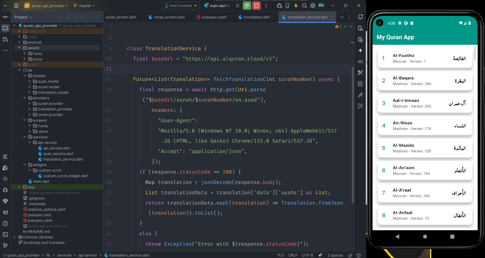

# 📖 My Quran App – API + Provider

A clean and structured Quran Application built using **Flutter** with **Provider** for state management and real-time data fetching from the **AlQuran Cloud API**.

This project demonstrates API integration, state management using ChangeNotifier, structured folder organization, and dynamic UI rendering of Surahs, Ayahs, and English translations.

---

# 📱 Application Screens (Sequential Flow)

## 🏠 1️⃣ Surah List Screen

Displays all Surahs fetched from the API including:

• Surah number
• Surah name (English & Arabic)
• Revelation type (Meccan / Medinan)
• Total number of verses

<p align="center">
  
</p>

---

## 📜 2️⃣ Verse View Screen

When a Surah is selected, the app navigates to the Verse View screen which displays:

• Arabic Ayah text
• Verse number
• Clean card-based UI
• Scrollable layout

<p align="center">
  
</p>

---

## 🌍 3️⃣ Translation Screen

Each verse includes English translation fetched dynamically from the API.

• Translation fetched using separate endpoint
• Structured JSON parsing
• Displayed below Arabic text
• Clean separation between Ayah & Translation

---

# 🚀 Core Features

• Fetch Surah list from AlQuran Cloud API
• Fetch Ayahs of selected Surah
• Fetch English translation (en.asad)
• Provider-based state management
• ChangeNotifier implementation
• Async API handling with loading & error states
• Structured folder architecture
• Clean and readable UI

---

# 🏗 Architecture Overview

The application follows a structured folder-based architecture:

```
lib/
 ├── models/        # Data models (Surah, Ayah, Translation)
 ├── providers/     # ChangeNotifier providers (State logic)
 ├── services/      # API service classes
 ├── screens/       # UI screens
 ├── widgets/       # Reusable widgets
 └── main.dart
```

### 🔹 Model Layer

Handles JSON parsing and data modeling for API responses.

### 🔹 Provider Layer

Manages:
• API calls
• Loading states
• Error handling
• UI updates

### 🔹 Service Layer

Contains HTTP logic and endpoint handling.

---

# 🌐 API Integration

Base URL:

```
https://api.alquran.cloud/v1
```

Endpoints Used:

• /surah
• /surah/{number}
• /surah/{number}/en.asad

---

# 🔄 Application Flow

App Start → Fetch Surah List → User Selects Surah → Fetch Ayahs → Fetch Translation → Update Provider State → Render UI

---

# 🧠 Concepts Applied

• REST API Integration
• HTTP GET Requests
• JSON Decoding & Mapping
• ChangeNotifier & Consumer Pattern
• Asynchronous Programming (Future / async-await)
• Clean Folder Structure
• UI-State Separation

---

# 🗄 Tech Stack

• Flutter
• Dart
• Provider
• HTTP Package
• AlQuran Cloud API

---

# 📦 Installation

```bash
git clone <repository-url>
cd quran_api_provider
flutter pub get
flutter run
```

---

# 📌 Summary

This Quran App demonstrates structured Flutter development using Provider for state management and clean API integration. The application dynamically renders Surahs, verses, and translations while maintaining scalable architecture and responsive UI.

---

💡 Built with focus on structured state management, API-driven UI, and clean Flutter architecture.
